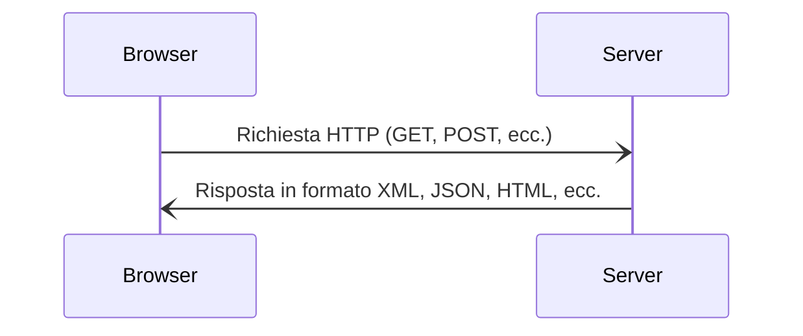

# Cos'è AJAX?

<p>AJAX è un'insieme di tecniche che consentono di inviare richieste HTTP asincrone ad un webserver.</p>

<div class="grid grid-cols-1 gap-10 pt-4 -mb-6">



</div>

<style>
  p {
    font-size: 1.2rem;
    text-align: center;
    padding-top: 1rem;
    font-color: white;
  }
  div.mermaid {
    display: flex !important; 
    justify-content: center 
  }
</style>

---
transition: slide-left
level: 2
---

# Esempi di utilizzo di AJAX

### **XHR** - XMLHttpRequest

<p>XMLHttpRequest è un oggetto utizzabile in vanilla JavaScript per effettuare richieste HTTP asincrone.</p>

```js
const xhttp = new XMLHttpRequest();
xhttp.onreadystatechange = function() {
  if (this.readyState == 4 && this.status == 200) {
  }
};
xhttp.open("GET", "form.php", true);
xhttp.send();
```
<br />

### **jQuery**

```js
$.ajax({
  url: "form.php",
  type: "GET",
  success: function(result) {
  }
});
```

<style>
  p {
    font-size: 1rem;
  }
</style>