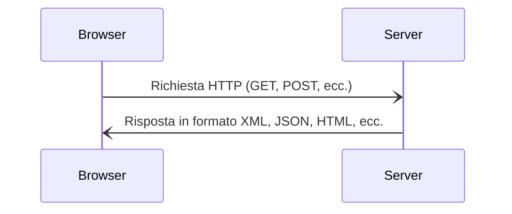

---
# try also 'default' to start simple
theme: seriph
# random image from a curated Unsplash collection by Anthony
# like them? see https://unsplash.com/collections/94734566/slidev
background: ./images/background.jpeg
# apply any windi css classes to the current slide
class: 'text-center'
# https://sli.dev/custom/highlighters.html
highlighter: shiki
# show line numbers in code blocks
lineNumbers: false
# persist drawings in exports and build
drawings:
  persist: false
# page transition
transition: slide-left
# use UnoCSS
css: unocss
---

# AJAX,  SQL e NOSQL

Fatto da Marano Andrea

<div class="abs-br m-6 flex gap-2">
  <button @click="$slidev.nav.openInEditor()" title="Open in Editor" class="text-xl slidev-icon-btn opacity-50 !border-none !hover:text-white">
    <carbon:edit />
  </button>
  <a href="https://github.com/slidevjs/slidev" target="_blank" alt="GitHub"
    class="text-xl slidev-icon-btn opacity-50 !border-none !hover:text-white">
    <carbon-logo-github />
  </a>
</div>

<!--
The last comment block of each slide will be treated as slide notes. It will be visible and editable in Presenter Mode along with the slide. [Read more in the docs](https://sli.dev/guide/syntax.html#notes)
-->

---
transition: slide-left
layout: default
---

# Indice

<Toc></Toc>

---
transition: slide-left
---

# Cos'è AJAX?

<p>AJAX è un'insieme di tecniche che consentono di inviare richieste HTTP asincrone ad un webserver.</p>

<div class="grid grid-cols-1 gap-10 pt-4 -mb-6">



</div>

<style>
  p {
    font-size: 1.2rem;
    text-align: center;
    padding-top: 1rem;
    font-color: white;
  }
  div.mermaid {
    display: flex !important; 
    justify-content: center 
  }
</style>

---
transition: slide-left
level: 2
---

# Esempi di utilizzo di AJAX

### **XHR** - XMLHttpRequest

<p>XMLHttpRequest è un oggetto utizzabile in vanilla JavaScript per effettuare richieste HTTP asincrone.</p>

```js
const xhttp = new XMLHttpRequest();
xhttp.onreadystatechange = function() {
  if (this.readyState == 4 && this.status == 200) {
  }
};
xhttp.open("GET", "form.php", true);
xhttp.send();
```
<br />

### **jQuery**

```js
$.ajax({
  url: "form.php",
  type: "GET",
  success: function(result) {
  }
});
```

<style>
  p {
    font-size: 1rem;
  }
</style>

---
transition: slide-left
---

# Database

Un database è un archivio di dati che permette di organizzare, gestire e recuperare informazioni.

### Tipologie di database
<li> <mdi-database /> SQL - Relazionale</li>
<li> <ph-graph-bold />  NOSQL - Non relazionale </li>
<br />


<style>
  img {
    -webkit-filter: invert(70%);
    filter: invert(70%) saturate(100%);
  }
  li {
    padding-top: 10px;
  }
</style>

---
transition: slide-up
level: 2
---

# SQL - Structured Query Language
SQL è un linguaggio standardizzato per interrogare e gestire i dati contenuti in un database relazionale.

## PHP

In PHP è possibile utilizzare la libreria MySQLi per connettersi ad un database MySQL.

```php
$conn = new mysqli($servername, $username, $password, $dbname);

$stmt = $conn->prepare("SELECT nome FROM Utenti WHERE cognome=?");
$stmt->bind_param("s", $lastname);

$nome = "";
$lastname = "Rossi";
$stmt->execute();

$stmt->bind_result($nome);

$stmt->close();
$conn->close();
```
---
transition: slide-up
level: 2
---

# NoSQL - Not Only SQL
NoSql è un tipo di database che permette di archiviare e recuperare dati senza dover definire la struttura dei dati stessi.

### Vantaggi

- Maggiore flessibilità per i dati non normalizzati
- Scalabilità per elevate quantità di dati
- Semplicità di gestione (es. attraverso REST API)

<br />

### Svantaggi

- Mancanza di standardizzazione
- Mancanza di integrità referenziale
- Ogni database ha la sua sintassi
- Non è possibile effettuare JOIN tra entità 

---
transition: slide-up
level: 2
---

# Esempio di tabella SQL e documento NoSQL

### SQL

```sql
CREATE TABLE Utenti (
  id INTEGER AUTO_INCREMENT PRIMARY KEY,
  nome VARCHAR(50) NOT NULL,
  cognome VARCHAR(50) NOT NULL,
  indirizzo VARCHAR(100) NOT NULL
);
```
<br />

### NoSQL

```json
{
  "nome": "Mario",
  "cognome": "Rossi",
  "indirizzo": {
    "via": "Via Roma",
    "civico": "1",
    "città": "Milano"
  }
}
``` 